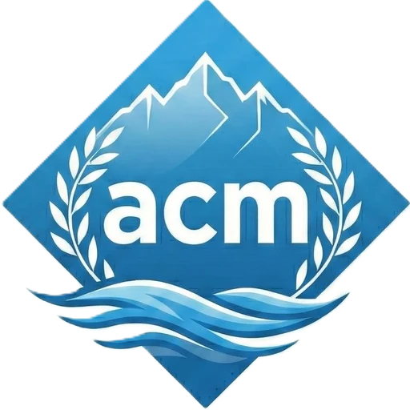
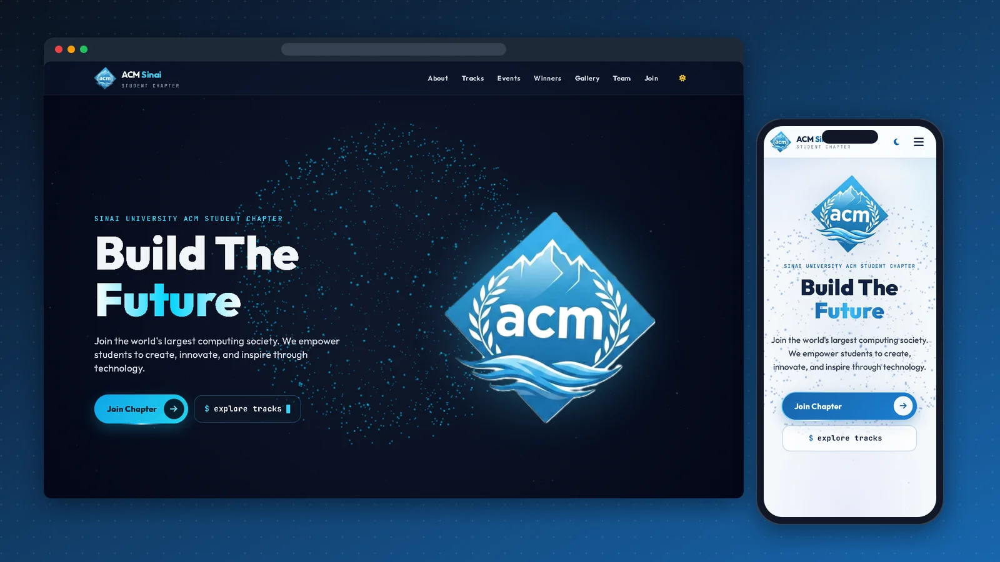
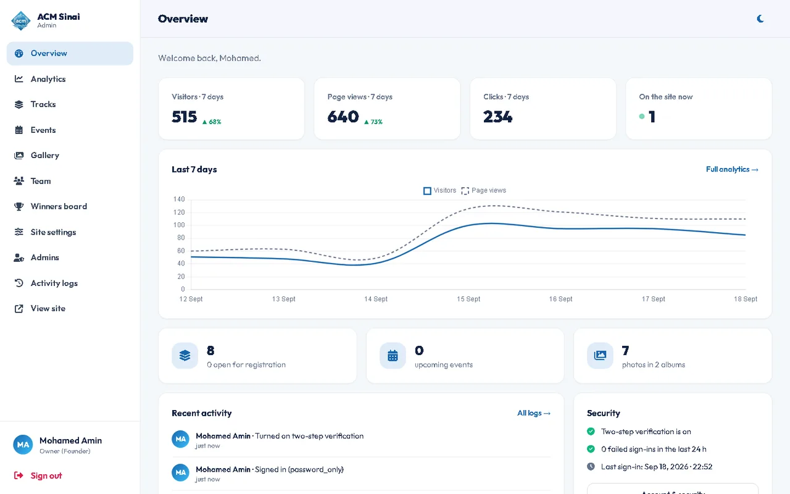
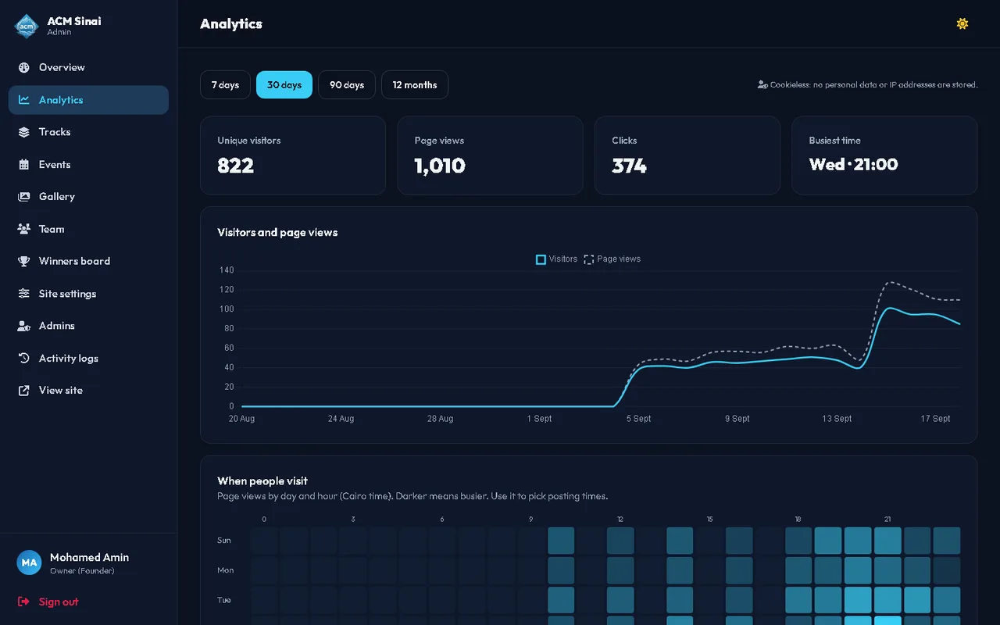
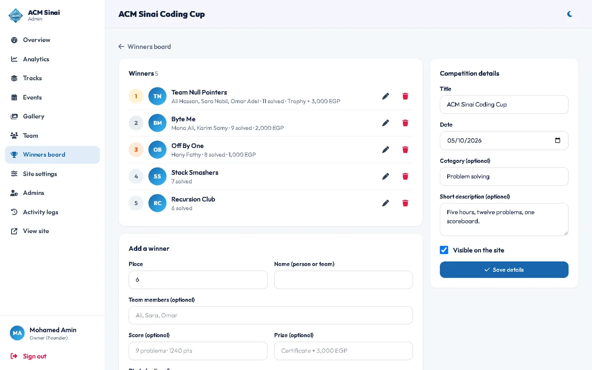
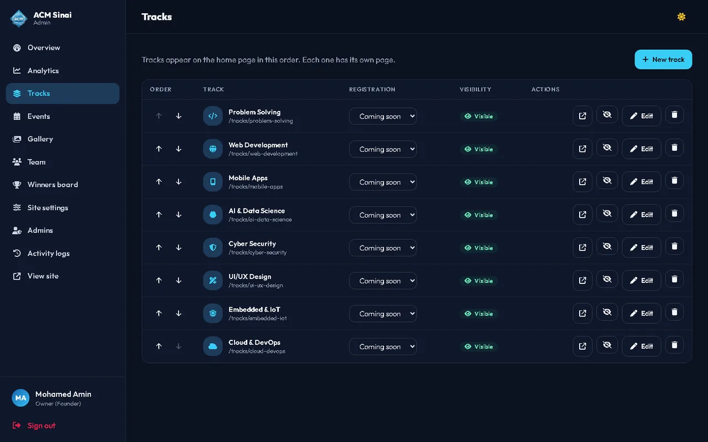

<div align="center">



# ACM Sinai Platform

**Website and admin dashboard of the Sinai University ACM Student Chapter.**

[](https://su.acm.org)




</div>

## ✨ Highlights

- **A living home page:** an interactive three.js particle sphere, scroll-reveal motion, light and dark themes, and a layout designed for phones first
- **Everything is editable from the dashboard:** tracks, events, gallery albums, the team, a competitions winners board, and the site's text and links
- **Winners board:** each competition has a date, category and ranked winners; the site shows a rising podium for the top three
- **Profile cards:** click any member or winner to open a card with photo, role, bio and LinkedIn
- **Private by design:** cookieless analytics with visitors, sections reached, referrers, devices and a busiest-hour heatmap
- **Secure by default:** Argon2id, two-step sign-in, CSRF, a strict CSP, roles and a full audit log (details below)

## 🖥 The dashboard

<table>
  <tr>
    <td><p align="center"><sub>Overview</sub></p></td>
    <td><p align="center"><sub>Analytics (dark mode)</sub></p></td>
  </tr>
  <tr>
    <td><p align="center"><sub>Winners board</sub></p></td>
    <td><p align="center"><sub>Tracks</sub></p></td>
  </tr>
</table>

<sub>Dashboard screenshots use demo data.</sub>

| Area | Who | What |
|---|---|---|
| Overview | everyone | Key numbers, recent activity, security status |
| Analytics | owner, admin | Visitors, page views, clicks, busiest day/hour heatmap, sections reached, referrers, devices. Cookieless, no IPs stored |
| Tracks | owner, admin | Add, edit, reorder, hide, delete. Icon, skills, roadmap, mentor, registration status (open / soon / closed), join link. Each track has a page at `/tracks/<slug>` |
| Events | owner, admin, editor | Poster, date, location, registration and meeting links. Upcoming/past switch automatically; pin the four that lead the home page |
| Gallery | owner, admin, editor | Albums, bulk photo upload (drag and drop), captions, cover, ordering |
| Winners board | owner, admin, editor | Competitions with a date and category, ranked winners with team members, score, prize and photo |
| Team | owner, admin | High Board (founders), faculty sponsor, current board, advisory board, short bios and LinkedIn |
| Site settings | owner, admin | Hero and about text, registration open/closed and link, new-board teaser, contact and social links |
| Admins | owner | Create accounts, change roles, disable, reset two-step verification, unlock |
| Activity logs | owner, admin | Every change (who, what, when, IP) and every sign-in attempt |

## 🔐 Security

- Passwords hashed with Argon2id; minimum 12 characters with letters and numbers
- Two-step verification (TOTP apps) with one-time recovery codes, **required for owners and admins**
- Account lock after 5 wrong passwords (15 min) and per-network throttling; generic error messages
- Sessions stored in the database; the cookie is limited to `/admin`, `HttpOnly`, `SameSite=Strict`, `Secure`, with a 30 min idle and 8 h absolute timeout, and bound to the browser
- CSRF token on every form; strict Content-Security-Policy and security headers (helmet); HTTPS enforced
- Uploaded images are decoded and re-encoded to WebP with `sharp`; anything that is not a real image is rejected, and uploads are only ever served as static files
- Only `http(s)` links are accepted in forms, and all output is escaped
- `/admin` is `noindex` and disallowed in `robots.txt`

## 🏗 How it is built

```
app.js                  Passenger entry point
src/server.js           Express app: helmet/CSP, static files, sessions, routers
src/routes/public.js    Home, track pages, sitemap, analytics beacon
src/routes/admin.js     Dashboard (auth, CRUD, uploads, settings, logs)
src/lib/                auth (Argon2, TOTP, CSRF, roles), analytics, uploads (sharp), content queries
views/                  EJS templates for the site and the dashboard
styles/input.css        Tailwind source with the design tokens and motion
public/assets/js/       site.js (sphere, reveal, rail, popups), admin.js
migrations/             Numbered SQL files, applied by npm run migrate
test/e2e.local.js       Playwright end-to-end checks (39 of them)
```

## 🚀 Run it locally

```bash
cp .env.example .env        # fill in local database settings
npm install
npm run migrate             # creates tables and the initial content
npm run create-owner -- --email you@example.com --name "Your Name"
npm run build:css
npm run dev                 # http://localhost:3000
```

## 📦 Deploying on cPanel

### First time

1. **Database:** cPanel → *Manage My Databases*: create a database and a user, and give the user *All privileges* on it.
2. **Code:** cPanel → *Terminal*:
   ```bash
   cd ~ && git clone https://github.com/Mo1Amin/acm-sinai-website.git
   ```
3. **Node app:** cPanel → *Setup Node.js App* → *Create application*:
   - Node.js version: **22**
   - Application mode: **Production**
   - Application root: `acm-sinai-website`
   - Application URL: your domain
   - Application startup file: `app.js`
   - Environment variables: none (they live in `.env`)
4. **Settings:** in the terminal, create `~/acm-sinai-website/.env` from `.env.example` and fill in the database and the two random secrets.
5. **Install and set up:** copy the "Enter to the virtual environment" command shown at the top of the Node.js app page, then:
   ```bash
   cd ~/acm-sinai-website
   npm ci --omit=dev && npm install --no-save --include=dev tailwindcss@3 && npm run build:css
   npm run migrate
   npm run create-owner -- --email you@example.com --name "Your Name"
   ```
   Restart the app from the Node.js app page. Sign in at `/admin` and turn on two-step verification.
6. **Keep it awake:** cPanel → *Cron Jobs*, every 5 minutes:
   ```
   curl -fsS https://your-domain/healthz > /dev/null 2>&1
   ```

### Updates

Every push to `main` deploys automatically once these repository secrets exist (*Settings → Secrets and variables → Actions*): `SSH_HOST`, `SSH_PORT`, `SSH_USER`, `SSH_KEY` (a private key whose public key is authorized in cPanel → *SSH Access*), and `NODEVENV` (the path in the "Enter to the virtual environment" command, for example `/home/<user>/nodevenv/acm-sinai-website/22/bin/activate`).

Manual update from the cPanel terminal:

```bash
source /home/<user>/nodevenv/acm-sinai-website/22/bin/activate
cd ~/acm-sinai-website && git pull && npm ci --omit=dev && npm install --no-save --include=dev tailwindcss@3 && npm run build:css && npm run migrate -- --no-seed
cloudlinux-selector restart --json --interpreter nodejs --app-root acm-sinai-website
```

Uploaded images live in `public/uploads/` on the server and are never overwritten by a deploy. Back them up together with the database (cPanel → *Backup*).

---

<div align="center">Designed and built by <a href="https://github.com/Mo1Amin">Mohamed Amin</a>, co-founder of the Sinai University ACM Student Chapter</div>
